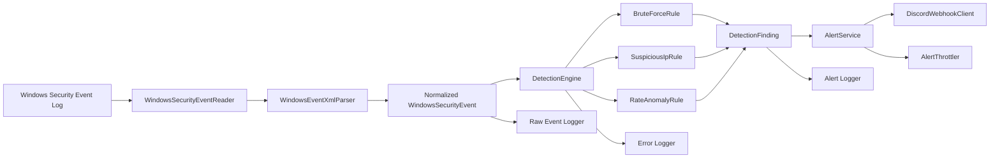

# RDP Login Monitoring & Alert System

> Production-grade Python backend for Windows Security Event Log monitoring, RDP login detection, brute-force defense, suspicious IP alerting, and Discord webhook notifications.

**Designed and maintained by Basil Saji Mathew (BSM).**

[](https://www.python.org/)
[](https://www.microsoft.com/windows)
[](#features)
[](#architecture)
[](#author)

## Table of Contents

- [Overview](#overview)
- [Why This Project](#why-this-project)
- [Features](#features)
- [Architecture](#architecture)
- [Project Structure](#project-structure)
- [Detection Engine](#detection-engine)
- [Repository Docs](#repository-docs)
- [Requirements](#requirements)
- [Quick Start](#quick-start)
- [Configuration](#configuration)
- [CLI Usage](#cli-usage)
- [Example Output](#example-output)
- [Testing](#testing)
- [Security Notes](#security-notes)
- [Author](#author)

## Overview

**RDP Login Monitoring & Alert System** is a cybersecurity backend service built to monitor Windows Security Event Logs in near real time, normalize RDP login activity, detect hostile authentication behavior, and notify operators through structured Discord alerts.

This repository is designed as a **job-portfolio-grade backend security project**. It emphasizes modular engineering, clean architecture, typed domain models, operational logging, configuration hygiene, and service lifecycle control.

SEO keywords naturally covered by this project include:

- Windows RDP monitoring
- Windows Event Log monitoring in Python
- RDP brute-force detection
- Discord webhook security alerts
- Security event normalization
- Backend cybersecurity project
- Blue team monitoring automation

## Why This Project

RDP remains one of the most targeted remote access surfaces in Windows environments. Failed logons, password spraying, and suspicious successful logins are common precursors to compromise. This system provides a focused backend pipeline for:

- ingesting authentication events from Windows Security logs
- filtering for RDP-relevant activity
- detecting brute-force and high-velocity login behavior
- surfacing suspicious logins from unknown IP addresses
- sending operational alerts without flooding downstream channels

## Features

- Continuous monitoring of Windows Security Event IDs `4624` and `4625`
- RDP-focused filtering using `LogonType` `10` and `7`
- Strongly typed normalized event models
- Clean separation between ingestion, detection, alerting, and runtime control
- Brute-force detection with configurable sliding windows
- Suspicious IP detection with whitelist support
- Rate anomaly detection for high-volume authentication spikes
- Discord webhook alerting with retry and incremental backoff
- Alert throttling to prevent duplicate spam
- Structured JSON logging with rotation for raw events, alerts, and errors
- YAML configuration with `.env` environment variable overrides
- Background or foreground CLI execution with `start`, `stop`, and `status`
- Included repository docs for licensing, security policy, contributing, changelog, and ownership

## Architecture

The service follows a modular backend layout so each layer can evolve independently.



### Layer Responsibilities

- `app/monitor/`: Windows Event Log querying and XML parsing
- `app/models/`: event and alert domain models
- `app/core/`: stateful rule engine and sliding-window logic
- `app/services/`: logging, runtime orchestration, alert delivery
- `app/config/`: YAML and environment-based settings loading
- `app/main.py`: CLI entry point and service bootstrap

## Project Structure

```text
Rdp-Login-Monitor/
|-- app/
|   |-- main.py
|   |-- config/
|   |   |-- __init__.py
|   |   `-- settings.py
|   |-- core/
|   |   |-- __init__.py
|   |   |-- engine.py
|   |   |-- rules.py
|   |   `-- state.py
|   |-- models/
|   |   |-- __init__.py
|   |   |-- alerts.py
|   |   `-- events.py
|   |-- monitor/
|   |   |-- __init__.py
|   |   |-- parser.py
|   |   `-- reader.py
|   `-- services/
|       |-- __init__.py
|       |-- alerting.py
|       |-- application.py
|       |-- logging_service.py
|       `-- runtime.py
|-- config/
|   `-- settings.yaml
|-- tests/
|   |-- test_parser.py
|   `-- test_rules.py
|-- .env.example
|-- .gitignore
|-- AUTHORS.md
|-- CHANGELOG.md
|-- CODE_OF_CONDUCT.md
|-- CONTRIBUTING.md
|-- LICENSE.md
|-- NOTICE.md
|-- README.md
|-- SECURITY.md
|-- SUPPORT.md
`-- requirements.txt
```

## Detection Engine

### Brute Force Detection

Tracks repeated failed RDP logons from the same source IP over a configurable window.

- Default threshold: `5` failed attempts
- Default window: `120` seconds
- Trigger output: `Brute Force Detected`

### Suspicious IP Detection

Flags successful RDP logins from non-whitelisted IPs and can optionally escalate repeated failures from unknown sources.

- Supports configurable IP whitelisting
- Useful for external login validation and remote access review

### Rate Anomaly Detection

Measures authentication velocity from a single IP and flags unusually high login volume that may indicate password spraying, noisy tooling, or rapid abuse.

- Default threshold: `20` events
- Default window: `300` seconds

## Repository Docs

- [AUTHORS.md](AUTHORS.md) - ownership and author information
- [NOTICE.md](NOTICE.md) - project attribution and branding notice
- [LICENSE.md](LICENSE.md) - usage and rights statement
- [CONTRIBUTING.md](CONTRIBUTING.md) - contribution workflow and standards
- [SECURITY.md](SECURITY.md) - vulnerability reporting guidance
- [SUPPORT.md](SUPPORT.md) - usage and support guidance
- [CODE_OF_CONDUCT.md](CODE_OF_CONDUCT.md) - collaboration expectations
- [CHANGELOG.md](CHANGELOG.md) - release history

## Requirements

- Windows host with access to the Security Event Log
- Python `3.11+`
- Administrative or equivalent permissions to read Windows Security logs
- Discord webhook URL if alerting is enabled

## Quick Start

```powershell
python -m venv .venv
.venv\Scripts\Activate.ps1
pip install -r requirements.txt
Copy-Item .env.example .env
```

Then update:

- `config/settings.yaml`
- `.env`

## Configuration

The service supports both YAML configuration and environment variable overrides.

### Configurable Areas

- Discord webhook settings
- Brute-force thresholds
- Suspicious IP thresholds
- Anomaly rate thresholds
- Log file paths and rotation
- IP whitelist and trusted users
- Polling behavior and runtime files

### Example Environment Variables

```env
RDP_MONITOR_WEBHOOK_URL=https://discord.com/api/webhooks/your/webhook/url
RDP_MONITOR_BRUTE_FORCE_ATTEMPTS=5
RDP_MONITOR_BRUTE_FORCE_WINDOW_SECONDS=120
RDP_MONITOR_WHITELIST_IPS=10.0.0.1,192.168.1.10
RDP_MONITOR_LOG_LEVEL=INFO
```

## CLI Usage

Start in the background:

```powershell
python -m app.main --config config/settings.yaml start
```

Start in the foreground:

```powershell
python -m app.main --config config/settings.yaml start --foreground
```

Check service status:

```powershell
python -m app.main --config config/settings.yaml status
```

Request graceful shutdown:

```powershell
python -m app.main --config config/settings.yaml stop
```

## Example Output

### Example Status Output

```json
{
  "running": true,
  "pid": 18540,
  "status": {
    "pid": 18540,
    "state": "running",
    "machine_name": "RDP-MONITORED-HOST",
    "processed_events": 118,
    "alerts_sent": 3,
    "last_error": null,
    "updated_at": "2026-03-25T12:20:35.418746+00:00"
  }
}
```

### Example Structured Raw Event Log

```json
{
  "timestamp": "2026-03-25T12:15:14.804697+00:00",
  "level": "INFO",
  "logger": "rdp_monitor.raw_events",
  "message": "Security event processed",
  "context": {
    "payload": {
      "record_id": 944108,
      "event_id": 4625,
      "timestamp": "2026-03-25T12:15:13.342000+00:00",
      "username": "administrator",
      "source_ip": "203.0.113.21",
      "machine_name": "RDP-MONITORED-HOST",
      "login_status": "failure",
      "logon_type": "10"
    }
  }
}
```

### Example Alert Concept

- Title: `Brute Force Detected`
- Username: `administrator`
- Source IP: `203.0.113.21`
- Attempts: `5`
- Delivery: Discord webhook JSON embed

## Testing

Run the included tests:

```powershell
pytest
```

If the environment is missing dev dependencies, install from `requirements.txt` first.

## Security Notes

- This project is intentionally focused on RDP-relevant Windows logon activity.
- Alert throttling reduces repeated webhook noise for the same detection key.
- Structured logs support incident review and downstream log shipping.
- Whitelisted infrastructure can be excluded from noisy alerts.
- Discord delivery errors are logged and retried with incremental backoff.

## Author

**Basil Saji Mathew (BSM)**  
Backend Engineer | Security-Focused Builder | Project Owner

This repository is branded and maintained as part of the BSM engineering portfolio. If you want the project extended further, the next strong upgrades would be:

- Windows service packaging
- persistent bookmarks for event log checkpoints
- database-backed event history
- geo-IP enrichment
- Slack, email, and SIEM integrations
